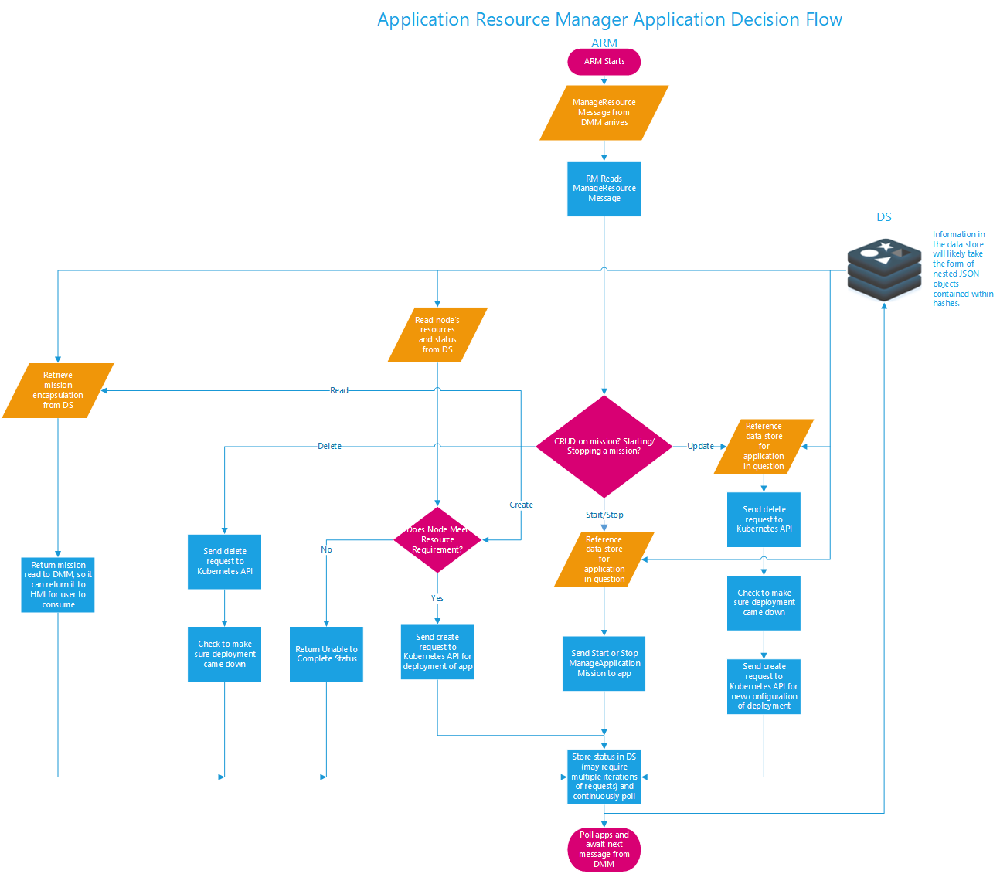
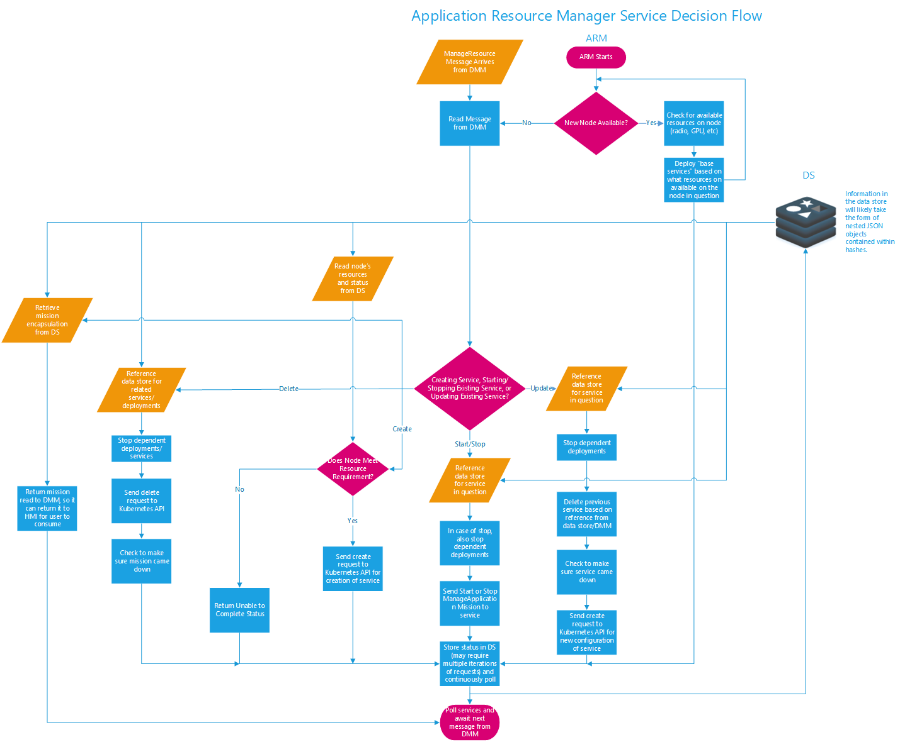
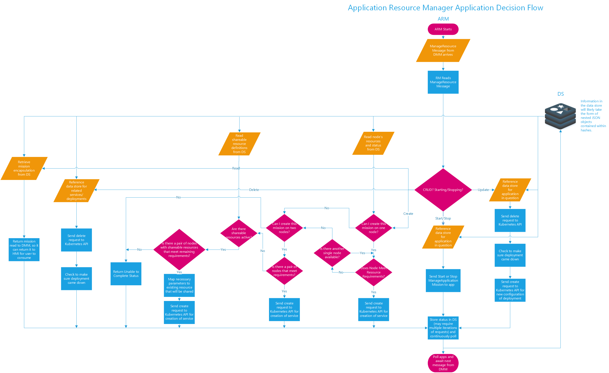
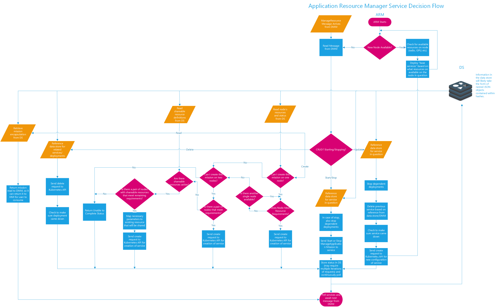
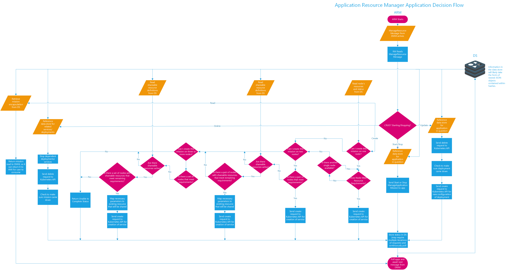
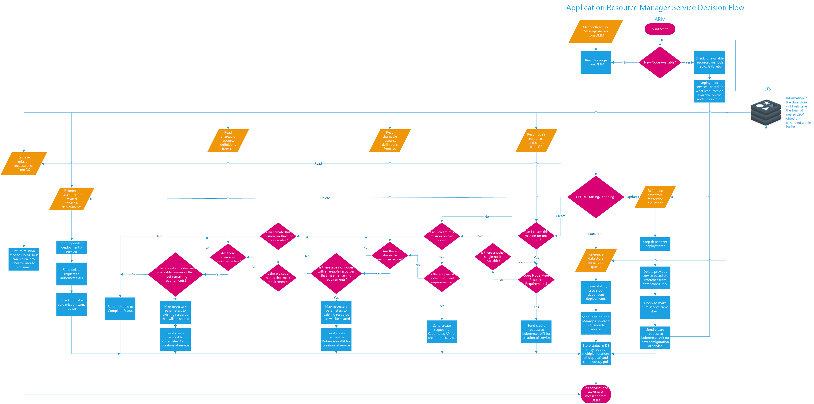

# Warfighter Expansion Baseline - resource_management 

Welcome to the resource_management REPO!

You will find all the Code and Dockerfiles related to Resource Manager.

The CI pipeline will run everytime you commit and push to gitlab inside this repo

## Build Statuses
### Master
Build Status: 
### Develop
Build Status: 
## Branching Strategy

### There are two protected branches:

 - master: only people with master level permissions and above can push to here
 - develop: only people with master level permissions and above can push to here
 
### The General strategy is as follows:
 
 - Create your feature branch from `develop`
 - Name your feature branch with the following syntax `feature/<name_of_feature_being_worked> `
 - Make your changes to the code related to common and push to your feature branch
 - When your feature is finished make a merge request for your feature branch to ber merged into develop, assign the POC associated with that feature to it, and check the box that says remove source branch
 - Send an email out to the team saying that there is a merge request to be reviewed and include the link
 - Once the POC and at least one other person give it a thumbs up, the feature will be merged into develop
 - The POC will make a merge request for develop into master and the PO will determine whether or not to accept the merge request
 
### Items of Note:
 
 - All pipelines `WILL` run the manage_enviornment
 - Docker builds, management, registry pushes, and triggers will happen on `MASTER AND DEVELOP ONLY!`
 - It is the Responsibility of the POC to pull other people in on the merge if they feel like it is needed
 
## Building the Source Code outside of the Pipeline
 
### Build All Docker Images Locally 
 - From your home directory, cd into your directory where your source code is stored ie: cd git/api_services
 - Once you are in that directory run the following command only if the docker base images are not on your host:
  - ./build_docker.sh

### Build A Singular Docker Image Locally
- from your home directory, cd into your directory where your source code is stored ie: cd git/api_services
 - once you are in that directory run the following commands:
  - cd <Core or Service>/<image you want to build>
  - docker build -t <name you want to test the image with>:<tag>

## Versioning Concept ##
- tags will be created off of master and will be determined according to the following schema:
 - tags will either be master, latest, or X.X.X where the Xs are integers
  - master will be created from the master branch
  - latest will be created from the develop branch
  - All X.X.X tags being generated from master and or release/bugfix branches

### Nominal versioning/tagging concept ###

- from master – and beyond – back to develop– using 1.0.0 as a starting point example)
- Major.minor.revision 
 - 1.0.0-rc1
 - 1.0.0-rc2
 - 1.0.0  (this would end up in a release branch being made)
  - release_1.0.0
  - release_1.0.X to support incremental bugfixes ( 1 to N)
  - release_1.X.X to roll up collective bugfixes
 - 1.0.1 – example of tagging of bugfixes into develop.

## Documentation ##
Detailed documentation can be found on the [wiki](https://gitlab.lmms.lmco.com/ws/expansion_baseline/resource_management/wikis/home).
 
### Resource Manager Decision Flows ###

#### Single Node Application Flow ####

#### Single Node Services Flow ####

#### Dual Node Application Flow ####

#### Dual Node Services Flow ####

#### N Node Application Flow ####

#### N Node Services Flow ####

## RAL/Precision Loopback Demo Process ##
For this demo, you will need 3 K8s Master Node (Quantum) windows, 1 or 2 K8s Worker Node(s) (Quark) windows, 4 Windows Powershell instances or 4 VS Code terminals, 3 MOBA ssh tunnels active, and 1 docker container running

### The 3 K8s Master Node (Quantum) windows will be used for: ###
 - One to get pod names as you bring up RAL and precision loopback, with the 'kubectl get pods' command
 - One to follow the output of RAL, with the 'kubectl logs -f <RAL pod name>' command
 - One to follow the output of precision loopback, with the 'kubectl logs -f <precision loopback pod name>' command

### The 1 or 2 K8s Worker Node(s) (Quark) windows will be used for: ###
 - One to run the docker container which serves as our redis cli
 - Optionally, one to show the radios before and after getting claimed

### The 4 Windows Powershell or VS Code terminals will be used for: ###
 - One to run gRPC middleware server (remember to start this one first) with the 'dotnet run --framework netcoreapp2.1'
 - One to run HMI with the 'dotnet run --framework netcoreapp2.1 50505' command
 - One to run DM with 'dotnet run 50505' command
 - One to run RM with the 'dotnet run 50505 <your computer's ip>:<application port (probably 30002)>' command

### The 3 MOBA ssh tunnels will be used for: ###
 - One to communicate to Kubernetes on the K8s Master Node (Quantum)
 - One to communicate to Redis on the K8s Worker Node (Quark)
 - One to communicate to the application on the K8s Worker Node (Quark)

### The one docker container will be used for: ###
 - Running our redis cli locally on the K8s Worker Node (Quark); this container currently exists on Quark, and it can be accessed with the command 'docker exec -it 0a073d00a52a /bin/bash'

### To set up the MOBA ssh tunnels: ###
 - Open MOBA
 - Click on tunneling in the ribbon above the console
 - For the K8s tunnel, set the desintation server and port to Quantum:6443 166.17.94.17:6443; set the ssh server to 166.17.94.17, the ssh login to your account name, and the ssh port to 22; set the forwarded port 6443 (this can be any port, but it is preferrable to match them to the destination)
 - For the Redis tunnel, set the destination server and port to Quark:31030 (166.17.94.20:6443); set the ssh server to 166.17.94.20, the ssh login to your account name, and the ssh port to 22; set the forwarded port 31030 (this can be any port, but it is preferrable to match them to the destination)
 - For the application tunnel, set the destination server and port to Quark:30002 (or whatever the application port number is) (166.17.94.20:6443); set the ssh server to 166.17.94.20, the ssh login to your account name, and the ssh port to 22; set the forwarded port 30002 (this can be any port, but it is preferrable to match them to the destination)
 - Make sure to turn all of these on with the start/stop buttons before running the demo

### For the docker container, once you docker exec into it: ###
 - Navigate to api_services/Redis/Interface/src/ApiService.RedisInterface/ConsoleApp
 - Here, you can dotnet run to get into the redis cli; and you will likely only need to do a ListAllKeys request (press 5, then 3) to achieve the purpose of the demo
 - As a note, if you exit the console app after running it, it will have difficulty rerunning; dotnet clean at the ConsoleApp and ApiService.RedisInterface levels before dotnet running again

### For the presentation, the order of steps goes as: ###
 - Deploy rald (from HMI, create (1) and the json is rald-deployment.json)
 - Go to Quantum, get the rald pod name, and use the second window of Quantum to show that rald is started in a wait state
 - Start rald (from HMI, start (6))
 - Go back to second Quantum instance to show that rald is starting; start OK message will return to CRM after it finishes starting
 - Deploy precision loopback (from HMI, create (1) and the json is precision-loopback,deployment.json)
 - Go to Quantum, get the precision loopback pod name, and use the third window of Quantum to show that precision loopback is operating
 - Read from Redis (from HMI, read (2), and you can enter the key name to whatever level you wish--Site:KOP: is a reliable way to get all the keys)
 - If you want to, you can show the Redis cli in the container on quark
 - If you want to, you can delete the deployments; make sure to deploy precision loopback first, because it is dependent on rald  (bear in mind it will take about 30 seconds for the precision loopback pod to stop operating)
 - If you want to, you can stop rald by sending a stop request from HMI. You can then also restart it
 - Again, you can delete the deployment of rald as well